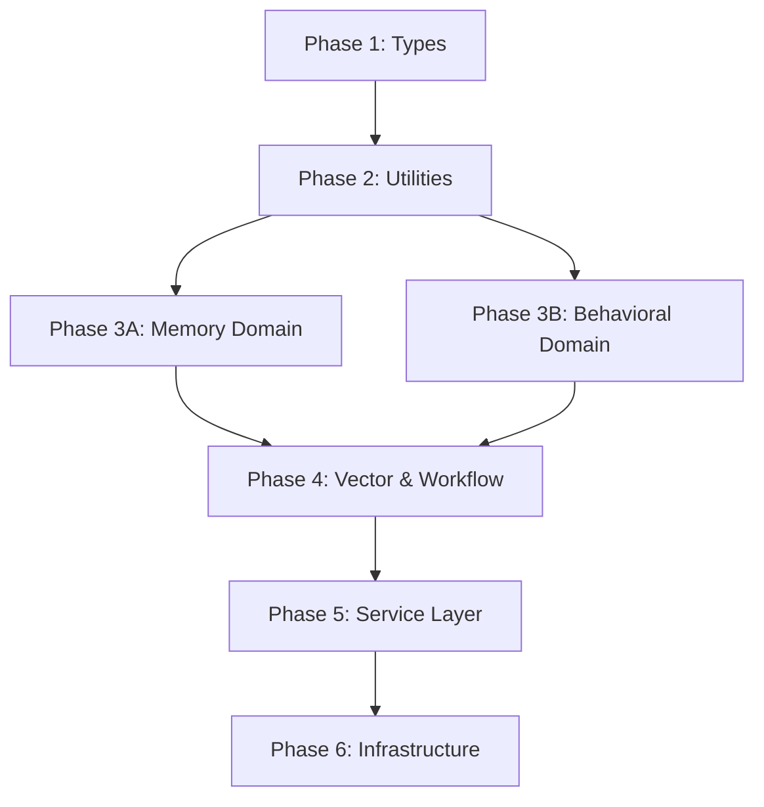

# Refactoring Implementation Checklist - Causally Tracked

## Master Implementation Plan
**Memory Entry IDs:** `557cff1e-7b28-4811-aa9b-de55330ad8b1` (Master) + 7 Phase Entries  
**Implementation Period:** 6 Weeks  
**Expected Completion:** October 7, 2025

---

## Phase 1: Type Consolidation (Week 1)
**Memory Entry:** `0a9ca7c5-ba9d-4b4e-9cd1-7489486af3de`  
**Dependencies:** None (Foundation Phase)  
**Status:** ⏳ Pending  
**Implementation Tracking:** Memory-driven with causal linking

### Pre-Phase Setup
- [ ] **Initialize Phase 1 Enhanced Plan Entry**
  ```bash
  memory_store_enhanced "Phase 1: Type Consolidation - Starting implementation with 3 duplicate files to consolidate"
  ```
- [ ] **Query previous implementation patterns**
  ```bash
  memory_search "type consolidation implementation success patterns"
  ```

### Deliverables (with Memory Tracking)
- [ ] Create `src/core/types/` directory structure
  **Memory:** Store creation with evidence of directory structure
- [ ] `src/core/types/index.ts` - Main type exports
  **Memory:** Store with causal link to phase plan + file creation evidence
- [ ] `src/core/types/memory.ts` - Memory interfaces consolidation
  **Memory:** Store with evidence of duplicate elimination from 3 files
- [ ] `src/core/types/behavioral.ts` - Behavioral interfaces
  **Memory:** Store with causal link + interface migration evidence
- [ ] `src/core/types/patterns.ts` - Pattern analysis interfaces  
  **Memory:** Store with causal link + pattern interface consolidation
- [ ] `src/core/types/workflow.ts` - Workflow interfaces
  **Memory:** Store with evidence of workflow type migration
- [ ] `src/core/types/federation.ts` - Federation interfaces
  **Memory:** Store with federation interface consolidation evidence
- [ ] Update all module imports (23+ modules)
  **Memory:** Store each module update with before/after import evidence
- [ ] Verify zero breaking changes
  **Memory:** Store TypeScript compilation success + test results
- [ ] Full test suite passing
  **Memory:** Store test completion with performance benchmarks

### Memory-Driven Success Criteria
- [ ] **Evidence-based completion verification**
  ```bash
  memory_search "Phase 1 type consolidation completed deliverables" --requireEvidence=true
  ```
- [ ] **Causal progress tracking** 
  ```bash
  memory_analyze_causality <phase1_plan_id> <work_item_id>
  ```
- [ ] **Implementation confidence calculation**
  - Target: 95% confidence based on evidence quality
  - Automatic calculation from completed work items
- [ ] **Pattern learning capture**
  ```bash
  memory_store_enhanced "Type consolidation success patterns learned"
  ```

---

## Phase 2: Extract Common Utilities (Week 2)
**Memory Entry:** `563788c5-3a24-4092-a53b-da7313f9812d`  
**Dependencies:** Phase 1 Complete  
**Status:** ⏳ Pending

### Deliverables
- [ ] Create `src/core/base/` utilities directory
- [ ] `src/core/base/BaseManager.ts` - Abstract base manager class
- [ ] `src/core/base/BaseOperations.ts` - Standard operations interface
- [ ] `src/core/base/PersistenceUtil.ts` - Memory persistence utilities
- [ ] `src/core/base/VectorUtil.ts` - Vector operation utilities
- [ ] `src/core/errors/` - Consolidated error definitions
- [ ] Update existing managers to extend BaseManager
- [ ] Performance benchmarking

### Success Criteria
- [ ] 40% reduction in duplicate persistence code
- [ ] All managers following consistent pattern
- [ ] Shared utilities tested and documented
- [ ] No performance degradation

---

## Phase 3A: Memory Domain Migration (Week 3)
**Memory Entry:** `ca3d398d-9bd5-4d91-83a5-380260f71164`  
**Dependencies:** Phase 2 Complete  
**Status:** ⏳ Pending

### Deliverables
- [ ] Create `src/domains/memory/` structure
- [ ] `domains/memory/core/CoreMemoryManager.ts` - Core memory operations
- [ ] `domains/memory/tiers/TierManager.ts` - Multi-tier coordination
- [ ] `domains/memory/tiers/ShortTermMemory.ts` - Short-term tier
- [ ] `domains/memory/tiers/IntermediateMemory.ts` - Intermediate tier
- [ ] `domains/memory/tiers/LongTermMemory.ts` - Long-term tier
- [ ] `domains/memory/enhanced/EnhancedMemoryManager.ts` - Enhanced features
- [ ] `domains/memory/enhanced/SemanticExpansion.ts` - Semantic logic
- [ ] `domains/memory/enhanced/CausalityAnalyzer.ts` - Causality analysis
- [ ] `domains/memory/index.ts` - Domain exports

### Success Criteria
- [ ] Memory domain completely self-contained
- [ ] Clear tier separation implemented
- [ ] Enhanced features properly isolated
- [ ] All memory-related imports updated

---

## Phase 3B: Behavioral Domain Migration (Week 3)
**Memory Entry:** `15a03c25-44f9-4fbb-b6a6-caf56101b4cb`  
**Dependencies:** Phase 2 Complete (Parallel with 3A)  
**Status:** ⏳ Pending

### Deliverables
- [ ] Create `src/domains/behavioral/` structure
- [ ] `domains/behavioral/patterns/PatternAnalyzer.ts` - Pattern analysis
- [ ] `domains/behavioral/patterns/BehavioralLearner.ts` - Behavioral learning
- [ ] `domains/behavioral/patterns/PatternTracker.ts` - Pattern tracking
- [ ] `domains/behavioral/rules/RuleManager.ts` - Rule management
- [ ] `domains/behavioral/rules/ViolationTracker.ts` - Violation tracking
- [ ] `domains/behavioral/folding/AgentTracker.ts` - Agent performance tracking
- [ ] `domains/behavioral/folding/StrategyEngine.ts` - Folding strategies
- [ ] `domains/behavioral/folding/ResultProcessor.ts` - Result modification
- [ ] `domains/behavioral/index.ts` - Domain exports

### Success Criteria
- [ ] Behavioral domain completely self-contained
- [ ] Adaptive memory folding fully implemented
- [ ] Pattern analysis properly isolated
- [ ] All behavioral imports updated

---

## Phase 4: Vector & Workflow Domains (Week 4)
**Memory Entry:** `acf8b669-7502-4d4a-b2e6-017c0f97f784`  
**Dependencies:** Phase 3A & 3B Complete  
**Status:** ⏳ Pending

### Deliverables
- [ ] Create `src/domains/vector/` structure
- [ ] `domains/vector/store/CloudflareVectorStore.ts` - Vector storage
- [ ] `domains/vector/prewarming/PrewarmingManager.ts` - Prewarming
- [ ] `domains/vector/search/SearchEngine.ts` - Search operations
- [ ] Create `src/domains/workflow/` structure
- [ ] `domains/workflow/analysis/WorkflowAnalyzer.ts` - Analysis
- [ ] `domains/workflow/integration/IntegrationManager.ts` - Integration
- [ ] `domains/workflow/plans/PlanManager.ts` - Plan management
- [ ] Create `src/domains/federation/` structure
- [ ] `domains/federation/auth/AuthManager.ts` - Authentication
- [ ] `domains/federation/rag/FederationRAG.ts` - RAG operations
- [ ] `domains/context/ContextManager.ts` - Context management

### Success Criteria
- [ ] Vector domain completely self-contained
- [ ] Workflow domain properly structured
- [ ] Federation domain isolated
- [ ] Cross-domain dependencies clearly defined

---

## Phase 5: Service Layer Implementation (Week 5)
**Memory Entry:** `d76948ab-e0ed-400b-b129-4b7c421ce5d7`  
**Dependencies:** Phase 4 Complete  
**Status:** ⏳ Pending

### Deliverables
- [ ] Create `src/services/` application service layer
- [ ] `services/MemoryService.ts` - Memory orchestration
- [ ] `services/BehavioralService.ts` - Behavioral orchestration
- [ ] `services/FederationService.ts` - Federation operations
- [ ] `services/WorkflowService.ts` - Workflow management
- [ ] `core/container/DependencyContainer.ts` - DI container
- [ ] Update `agent.ts` to use service layer
- [ ] Update `simplified-registry.ts` tool integration
- [ ] Integration tests for service layer

### Success Criteria
- [ ] Clean service layer orchestration implemented
- [ ] Dependency injection working correctly
- [ ] Cross-domain operations properly coordinated
- [ ] Performance maintained or improved
- [ ] Comprehensive integration testing passed

---

## Phase 6: Infrastructure & Cleanup (Week 6)
**Memory Entry:** `737edf17-6525-4d9d-ad11-1080162c7538`  
**Dependencies:** Phase 5 Complete  
**Status:** ⏳ Pending

### Deliverables
- [ ] Create `src/infrastructure/` structure
- [ ] `infrastructure/persistence/KVMemoryLayer.ts` - KV persistence
- [ ] `infrastructure/persistence/StateExtractor.ts` - State extraction
- [ ] `infrastructure/transport/MCPServer.ts` - Transport layer
- [ ] `infrastructure/monitoring/MetricsCollector.ts` - Monitoring
- [ ] `adapters/cloudflare/WorkerAdapter.ts` - Cloudflare adapters
- [ ] Complete documentation updates
- [ ] Performance benchmarking results
- [ ] Migration verification tests
- [ ] Final cleanup of deprecated files

### Success Criteria
- [ ] Infrastructure separated from business logic
- [ ] All technical debt addressed
- [ ] Performance benchmarks met
- [ ] Documentation completely updated
- [ ] Full test suite passing
- [ ] Clean, maintainable codebase

---

## Master Success Metrics

### Code Quality Targets
- [ ] **Code Duplication Reduction:** 40% (Target)
- [ ] **Import Complexity Reduction:** 60% (Target)
- [ ] **Build Time Impact:** < 10% increase
- [ ] **Test Coverage:** Maintain 95%+
- [ ] **Documentation Coverage:** 100% of public APIs

### Performance Benchmarks
- [ ] Memory usage impact < 15%
- [ ] Response time degradation < 5%
- [ ] Module load time improvement > 20%
- [ ] Bundle size reduction > 10%

### Architecture Quality
- [ ] Zero circular dependencies
- [ ] Clear domain boundaries
- [ ] Proper separation of concerns
- [ ] Consistent patterns across domains
- [ ] Clean import hierarchies

---

## Causal Dependency Map



## Progress Tracking

**Overall Progress:** 0% (0/6 phases complete)  
**Next Action:** Begin Phase 1 - Type Consolidation  
**Risk Level:** 🟢 Low (Well-planned phases with clear dependencies)

---

## Emergency Procedures

### Rollback Strategy
Each phase includes individual rollback procedures. Git branching ensures safe progress:
- `feature/refactor-phase-1` through `feature/refactor-phase-6`
- Daily commits with detailed messages
- Phase completion tagged for easy rollback points

### Escalation Path
1. **Yellow Alert:** Performance degradation > 10%
2. **Red Alert:** Breaking changes detected
3. **Emergency Stop:** Test coverage drops below 90%

**Last Updated:** August 26, 2025  
**Memory System:** Enhanced with causality tracking and semantic expansion
